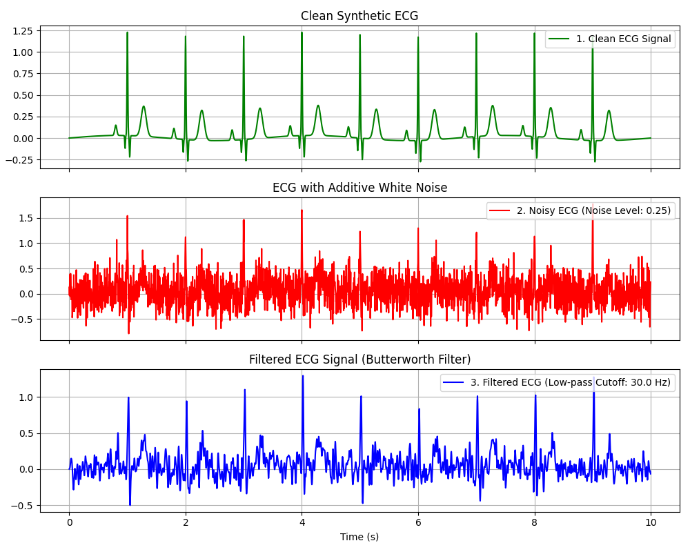
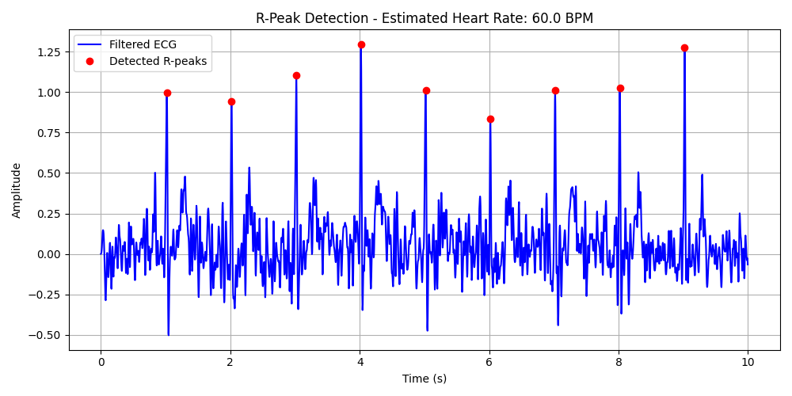
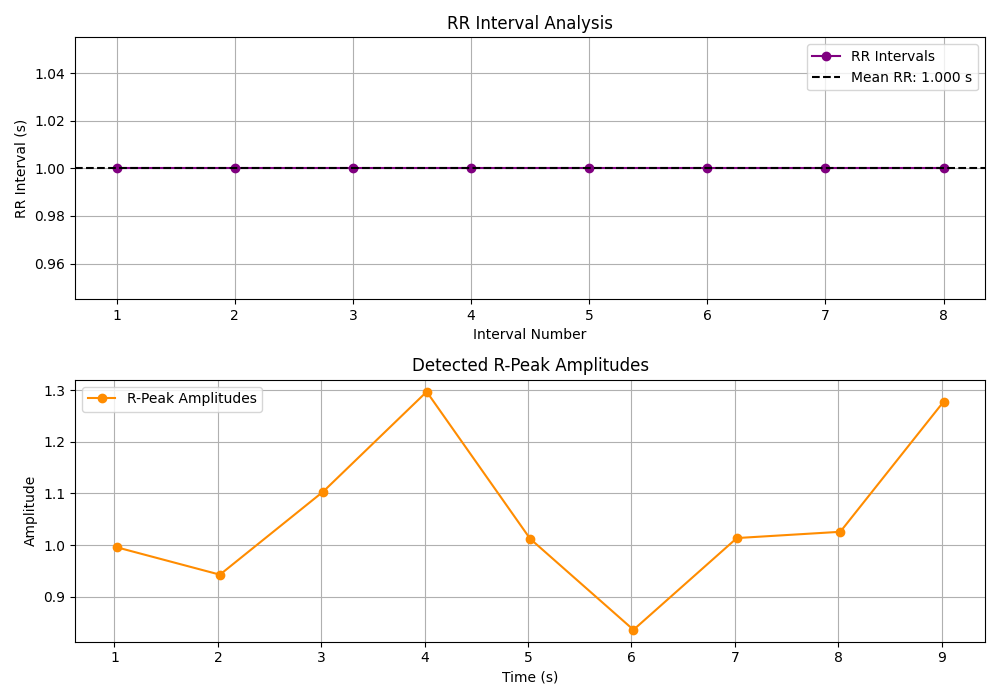
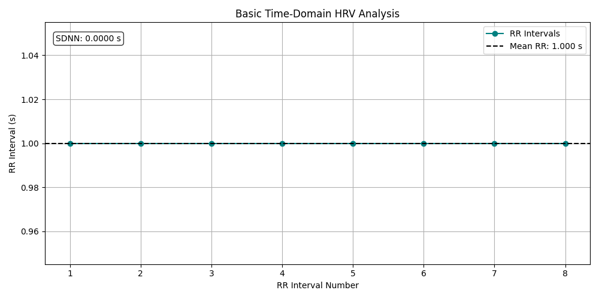

# ECG Signal Analyzer

An introductory ECG signal processing project developed for learning, practice, and academic coursework.

## Features
- Generate a synthetic ECG-like signal with simple P-Q-R-S-T morphology
- Add Gaussian noise to simulate a noisy acquisition
- Apply basic low-pass filtering (Butterworth) using SciPy
- Visualize clean vs noisy vs filtered signals
- Detect R-peaks from the filtered ECG signal
- Estimate heart rate in beats per minute (BPM)
- Extract basic ECG features from detected R-peaks
- Compute RR interval statistics:
  - Mean RR interval
  - Standard deviation of RR intervals
  - Minimum RR interval
  - Maximum RR interval
- Perform basic time-domain HRV analysis:
  - Mean RR
  - SDNN (standard deviation of normal-to-normal intervals)

## Project Structure
- `src/`: source code
- `Images/`: output figures and results
- `data/`: extracted feature files

## Requirements
Install dependencies:
```bash
pip install -r requirements.txt
```

## Usage
Run the main ECG processing script:

```bash
python src/ecg_processor.py
```

The script generates and saves the following outputs:

- `Images/Figure_1.png` → clean vs noisy vs filtered ECG comparison
- `Images/Figure_2.png` → detected R-peaks and estimated heart rate
- `Images/Figure_3.png` → RR interval analysis and R-peak amplitudes
- `Images/Figure_4.png` → basic time-domain HRV analysis
- `data/ecg_features.csv` → extracted ECG feature values
- `data/hrv_results.csv` → HRV summary results

## Feature Extraction Output
The current version of the project extracts the following ECG features:

- R-peak time positions
- R-peak amplitudes
- RR intervals
- Mean RR interval
- RR interval standard deviation
- Minimum RR interval
- Maximum RR interval

These extracted values are saved in:
`data/ecg_features.csv`

## HRV Analysis Output
The project also computes a simple time-domain HRV summary from detected R-peaks.

The HRV results include:
- Mean RR
- SDNN

These values are saved in:
`data/hrv_results.csv`

## Sample Output
### Figure 1 - Signal Comparison


### Figure 2 - R-peak Detection


### Figure 3 - Feature Extraction


### Figure 4 - Basic Time-Domain HRV Analysis


## How to Reproduce
1. Clone the repository:
```bash
git clone https://github.com/amirasadilamouki/ECG-Signal-Analyzer
```

2. Create and activate a virtual environment:
```bash
   python -m venv .venv
   .\.venv\Scripts\activate  # For PowerShell
```

3. Install dependencies:
```bash
pip install -r requirements.txt
```

4. Run the processor:
```bash
python src/ecg_processor.py
```

## Future Work

- Implementation of frequency-domain HRV analysis (e.g., LF/HF ratio)
- Integration of real-world ECG datasets (e.g., PhysioNet)
- Advanced noise reduction techniques for non-stationary artifacts

## Project Context
Developed for academic practice in Biomedical Signal Processing (2023).
